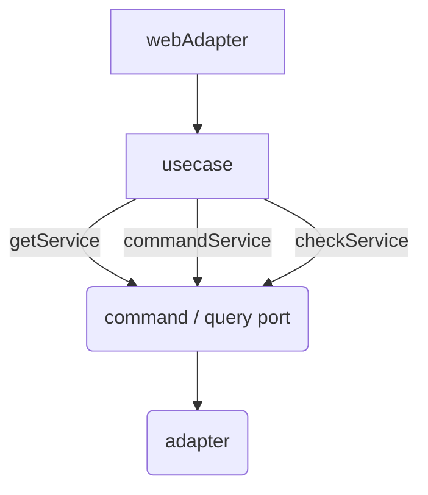

# DMS

- DMS는 효율적인 기숙사 관리를 위한 기숙사 관리 시스템입니다.
    - 사감선생님께선 웹으로 학생 정보를 편하게 조회, 관리하고 자습실이나 신청 데이터, 상/벌점 내역을 모아서 볼 수 있습니다. 
    - 학생은 사감선생님께 직접 찾아갈 필요 없이 앱으로 자습실, 잔류 등을 신청하고 필요한 정보를 확인할 수 있습니다.

## Backend
 
- 효율적인 유지보수와 기능 확장을 위해 DB Table과 아키텍처를 계획적으로 설계합니다.
    - 불필요한 중복 데이터, 중복 코드 없는 깔끔한 구조를 지향합니다.
    - 로직과 각 도메인의 역할이 명확히 구분되도록 합니다.

- 개발 효율을 위해 가독성에 항상 신경씁니다.
    - 적합한 변수, 메서드, 클래스 명을 작명할 수 있도록 합니다. 
    - detekt를 사용해 일관적인 스타일의 코드를 작성합니다.
 
- 프로젝트 구조나 설계 과정을 [Notion 문서](https://teamaliens.notion.site/Backend-a22b46ceb5334b80a40af21b3506c1db)에 기록합니다.

- 서버 인프라는 [Terraform](https://github.com/team-aliens/dms-infrastructure)을 사용해 구성합니다.

## ERD

## archtecture

### 지향하는 방향

- **DDD**
    - 도메인의 역할, 책임 분리
    - 각 객체가 서로간에 과하게 의존하지 않도록 하여 유지보수성 높임
- **Facade pattern**
    - usecase 코드(facade)의 DB 쿼리 호출에 대한 의존 분리
    - (각 service method는 하나의 의미를 가지는 단위로 구성)
- **Hexagonal Architecture**
    - 비즈니스 로직과 기술에 대한 상세 구현 분리
    - `core` - 핵심 로직 및 도메인 모델에 대한 코드
    - `presentation` - 웹 통신에 대한 관리 및 설정
    - `persistence` - DB 통신에 대한 관리 및 설정
    - `infrastructure` - 전체에 적용되는 필터, 설정이나 기타 third party 라이브러리에 대한 구현

### 처리 flow

(의존 방향이 아니라 진행 방향임)

---

### presentation module

**1. webAdapter** 
> 웹에서 요청을 받아, request body나 parameter 내용을 검증하는 역할

- 외부 요청은 **webRequest 객체**로 전달된다.
- webAdapter는 usecase에게 **request 객체 또는 value**를 전달한다.
    
    (request는 해당 객체로 domain이나 entity를 생성하야하거나, 별도 로직이 필요한 경우 정의함)
    
- usecase의 반환값을 **그대로 반환**한다.

---

### core module

**2. usecase (facade)**

> 각 usecase에 대한 **facade**를 나타내는 역할

- service 메서드를 호출하여 facade를 구성함 (port에 직접 의존하지 않음)
    - 전체적인 흐름만 나타내고, 도메인이나 query 호출에 대한 자세한 구현은 X → service에 메서드로 분리
- usecase에 특화된 로직을 직접 구현할 수도 있음

- usecase는 service에게 **domain model** **또는 value** 을 전달한다.
- usecase는 webAdapter에게 **response 객체**를 반환한다. (field가 nullable인 별도 domain model로 리팩토링 예정?)

**3. service**

> query나 port 호출을 domain과 관련된 **추상적 의미 단위로** 묶어주는 역할

- ex. A 조회시 해당 객체가 같은 학교의 객체인지 항상 검증해야한다.
    →  usecase에서 queryPort를 호출하고 매번 schoolId 비교를 해주지 않고, 해당 동작은 service에 메서드로 구현한다.
         그리고 usecase에서 A를 조회해야하는 경우 service에 정의되어있는 메서드를 사용한다.

service 종류 (깔끔한 분류를 위해 나눔)

- **CheckService**
    - 검증 메서드 
    - 주로 exist 확인 등등..
    
- **GetService**
    - 조회 메서드
    - 비슷한 쿼리가 필요한 경우 파라미터 nullable로 놓고 전달 (persistence쪽에서 동적쿼리 구현)
    - 필요한 경우 안에 체크 로직이 같이 들어갈 수 있음
    
- **CommandService**
    - 저장 혹은 삭제 메서드
    - 필요한 경우 안에 조회, 체크 로직이 같이 들어갈 수 있음

- delegate 패턴을 활용하여, 각 service 클래스 정의를 분리했다. [ 참고 : [Service 구조](https://www.notion.so/Service-9351a9ed1add4bc9a334e4d34c52984a?pvs=21) ]

**4. port**

- persistence나 infrastructure 계층과 소통하기 위한 interface (spi)

---

### persistence / infrastructure module

**5. Adapter**

- persistenceAdapter **:** JPA, QueryDSL을 통한 쿼리 구현
- 또는 기타 기술이나 라이브러리에 의존하는 세부 구현 내용
