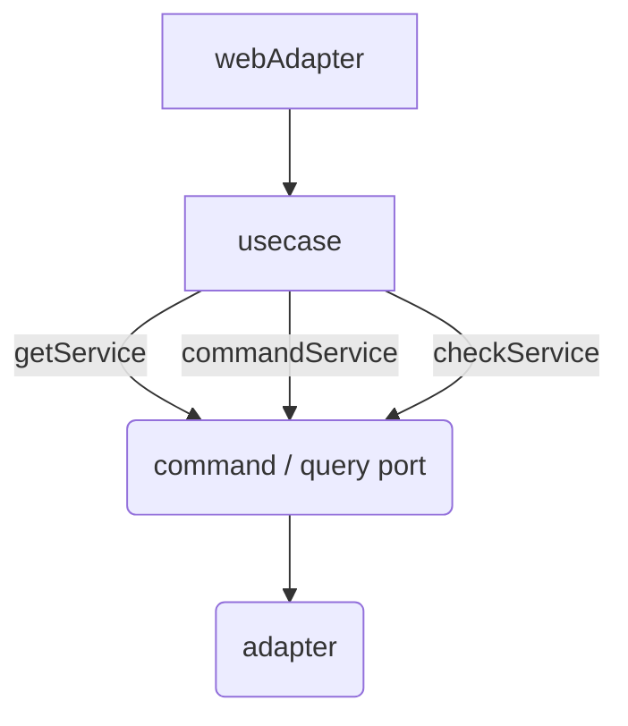

# 아키텍처

---

## 모듈 구조

`dms-main` 하나가 Gradle 서브모듈 4개로 나뉩니다.

| 모듈 | 의존 | 들어가는 것 |
| --- | --- | --- |
| `main-core` | (없음) | 도메인 모델, 유스케이스, 서비스, 포트(spi), 도메인 예외 |
| `main-persistence` | core | JPA 엔티티, QueryDSL 어댑터, 매퍼 |
| `main-presentation` | core | 컨트롤러(webAdapter), 웹 요청 DTO |
| `main-infrastructure` | 나머지 전부 | 부트 애플리케이션, 보안·설정, 외부 연동, 스케줄러, Flyway SQL |

**`main-core`는 아무에게도 의존하지 않습니다.** 바깥 모듈이 core의 포트 인터페이스를 구현해서 꽂히는 구조입니다.

---

## 요청 흐름



**절대 규칙**

1. 유스케이스는 포트를 직접 호출하지 않는다 — 항상 서비스를 거친다
2. 도메인 모델에 프레임워크 애노테이션을 붙이지 않는다 (JPA는 `main-persistence`에만)
3. 컨트롤러에 비즈니스 로직을 두지 않는다

---

## 헥사고날을 쓰는 이유와 대가

**이유**: 영속성 모델과 도메인 모델을 분리해 도메인 모델을 POJO로 유지합니다.
**대가**: 도메인 하나에 파일 10개 이상이 4개 모듈에 흩어집니다. **일정 산정에 반영해야 하는 비용입니다.**

---

## CQRS — 적용 범위

"CQRS"라 부르지만 실제로는 **읽기/쓰기 경로 분리까지**입니다.

| 항목 | 여부 |
| --- | --- |
| Command / Query 포트 분리 (`CommandXxxPort` / `QueryXxxPort`) | ✅ |
| 서비스 분리 (`CommandXxxService` / `GetXxxService` / `CheckXxxService`) | ✅ |
| 읽기 전용 프로젝션(VO) — 조회는 도메인 모델을 거치지 않음 | ✅ |
| 읽기 전용 DB, 이벤트 소싱, 별도 읽기 모델 테이블 | ❌ |
- **쓰기**는 도메인 모델을 거칩니다 (불변식 검증이 모델 메서드에 있으므로)
- **읽기**는 QueryDSL 프로젝션으로 VO를 바로 만듭니다
- `XxxService`(aggregate)가 세 서비스를 `by` 위임으로 묶고, 유스케이스는 이것 하나만 주입받습니다

---

## 검증 로직의 위치

| 검사 종류 | 위치 |
| --- | --- |
| 상태·값 불변식 (DB 불필요) | 도메인 모델 메서드 |
| 존재/중복 — 위반이면 예외 | `CheckXxxService` (`Unit`) |
| 존재 여부로 분기 | `CheckXxxService` (`Boolean`) |
| 조회 + "없으면 404" | `GetXxxService` 안에서 `?: throw` |
| 소유권·학교 스코프 | **유스케이스** |

마지막 줄만 유스케이스인 이유: 새 쿼리가 아니라 이미 가져온 값 둘의 비교이고, 횡단 관심사(`securityService`)가 끼기 때문입니다.
소유권 위반을 **"빈 결과"로 뭉개지 않고 전용 예외로 표현**하려는 것이기도 합니다 — `RemoveNoticeUseCase`가
`notice.managerId != user.id`로 `IsNotWriterException`(403)을 던지는 게 기준 형태입니다.

> ⚠️ **일부 옛 코드는 아직 이 규칙을 안 따릅니다.** `UpdateNoticeUseCase`는 `getNoticeByIdAndManagerId(noticeId, user.id)`로
> **쿼리 `WHERE`절에서** 작성자를 거릅니다. 이 경로는 소유권 위반이 "행 없음"이 되어 403이 아니라
> **`NoticeNotFoundException`(404)** 이 나갑니다 — 같은 도메인 안에서 삭제는 403, 수정은 404인 상태입니다.
>
> **신규 코드는 표의 규칙(유스케이스에서 비교)을 따르세요.** 남은 경로는 별도 이슈로 리팩토링합니다.
> 응답 코드가 404 → 403으로 바뀌므로 클라이언트 합의가 필요합니다.

---

## 트랜잭션

`@UseCase`는 `@Transactional`이지만 **보장하는 건 all-or-nothing이지 동시 쓰기로부터의 격리가 아닙니다.**
"상태 확인 → 그 상태를 전제로 변경" 사이에 다른 트랜잭션이 끼어들 수 있습니다.

경합이 실재하는 경로에서는 락 대신 **영향 행 수로 성공/실패를 판정**합니다.
판단 기준은 "그 상태를 동시에 바꿀 수 있는 다른 주체가 실재하는가"입니다.

**단, 영향 행 수는 조건절이 갖춰져야 판정이 됩니다.**

* `UPDATE`/`DELETE`의 **`WHERE`에 바꾸기 전 상태를 조건으로 넣고**, 반환된 영향 행 수를 검사해야 합니다.
  `deleteDaybreakStudyApplication`이 `studentId` + `status = PENDING`으로 지우고 `deletedCount > 0`을 올리는 게 이 형태입니다
* `WHERE`에 PK만 걸면 두 트랜잭션이 **각각 1행을 갱신하고 나중 것이 앞의 변경을 덮어씁니다.**
  이때의 1은 "내가 이겼다"가 아니라 그냥 "행이 있었다"입니다 — 아무것도 검출하지 못합니다
* 바꾸기 전 상태를 조건으로 표현할 수 없거나, 불변식이 여러 행·여러 테이블에 걸치면 이 방법으로는 안 잡힙니다.
  그때는 `SELECT ... FOR UPDATE`나 낙관적 락이 필요합니다 (현재 리포에는 둘 다 없습니다)

**사전 조회는 지우지 마세요.** 영향 행 수만 보면 "대상 없음(404)"과 "상태가 안 맞아 불가(400)"가 한 예외로 뭉개집니다.
사전 조회로 두 상황을 구분하고, 영향 행 수 검사는 **그 사이의 레이스만** 잡는 용도로 얹습니다.

---

## 이벤트 (알림)

```
도메인 서비스 → EventPort → ApplicationEvent
   → EventHandler (@Async + @TransactionalEventListener(AFTER_COMMIT))
      → FCM 발송 (항상) / 알림함 저장 (isSaveRequired == true 일 때만)
```

- RabbitMQ + Outbox는 제거됐고 `@Async` 이벤트로 대체됐습니다
- **재시도·DLQ가 없고 예외는 로그로만 남습니다.** 이벤트 간 순서도 보장되지 않으니 **같은 대상에 이벤트를 2개 발행하지 마세요**

---

## 보안 계층

```
ExceptionFilter → JwtAuthenticationFilter → SecurityConfig(authorizeHttpRequests) → Controller
```

- **인증/인가 판단은 `SecurityConfig` 한 곳에서만** 합니다. 필터는 헤더가 있을 때 토큰 형식만 검증합니다
- **컨트롤러에 매핑을 추가하면 `SecurityConfig`에 `requestMatchers`를 반드시 함께 추가**하세요. 없으면 `denyAll`입니다
- `requestMatchers`는 완전일치라 **경로변수 세그먼트까지** 적어야 합니다
- 역할 검사는 "이 역할인가"만 봅니다. 경로변수로 대상 ID를 받으면 소유권을 따로 확인하세요

---

## 패키지 구조

```
main-core/domain/<도메인>/
├── model/       도메인 모델, 상태 전이
├── usecase/     @UseCase
├── service/     Get / Command / Check + aggregate
├── spi/         포트 + vo/(읽기 프로젝션)
├── dto/         request · response
└── exception/   예외 + error/XxxErrorCode

main-persistence/persistence/<도메인>/   entity · mapper · repository · XxxPersistenceAdapter
main-presentation/domain/<도메인>/       XxxWebAdapter · dto/request
main-infrastructure/                     global(security·filter·config·error) · event · scheduler · thirdparty
```

### 네이밍

| 종류 | 규칙 |
| --- | --- |
| 포트 / 구현체 | `XxxPort` / `XxxAdapter` |
| 도메인 서비스 | `XxxService` + `XxxServiceImpl` |
| 유스케이스 | `<동사><대상>UseCase` |
| 컨트롤러 | `XxxWebAdapter` |
| 요청 DTO | `XxxWebRequest`(presentation) → `XxxRequest`(core) |
| 예외 | `XxxException`, **object로 선언**. 이름은 조건이 아니라 **막힌 액션**으로 |

---

## 하지 말 것

- 유스케이스가 포트 직접 호출
- 도메인 모델에 JPA 애노테이션
- 인가 규칙을 두 곳에 두기
- 컨트롤러만 추가하고 `SecurityConfig` 누락
- 리스트 요청 DTO에 `@NotNull` (빈 배열이 통과함 — `@field:NotEmpty`)
- 예외를 잡아 삼키기 (`object` 예외라 cause를 못 담으므로 던지기 전에 로깅)

---