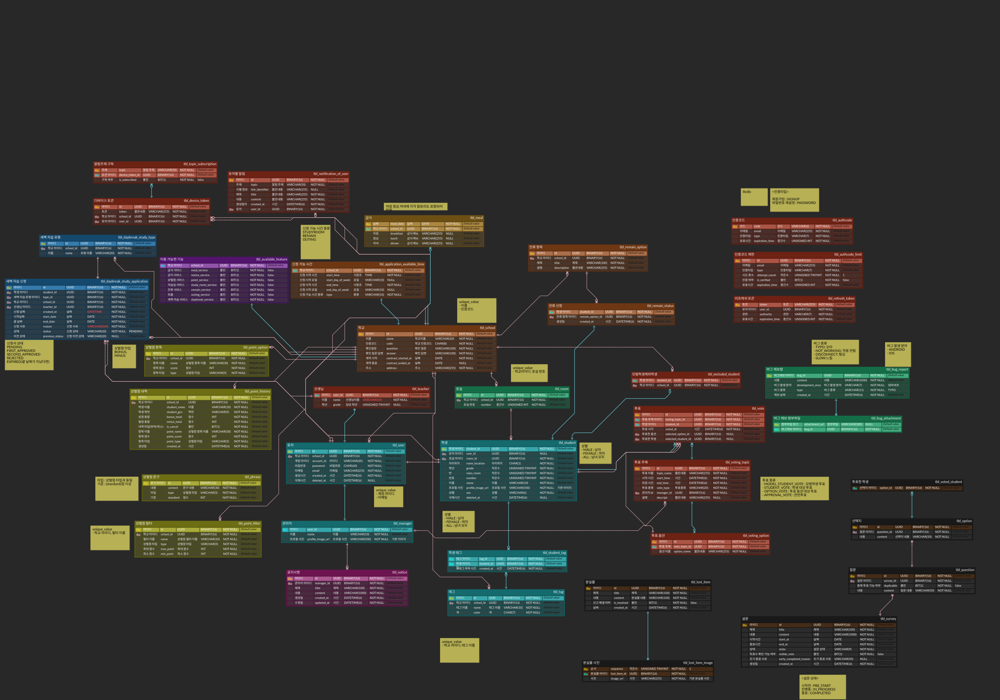

# 데이터베이스

스키마 규약과 Flyway 운영 규칙을 정리한 문서입니다.

---

## 구성

| 항목 | 값 |
| --- | --- |
| RDBMS | PostgreSQL 16 (`pgvector/pgvector:pg16`) |
| 마이그레이션 | Flyway — `V1__baseline.sql` 하나가 전체 스키마 |
| ORM | JPA + QueryDSL |
| `ddl-auto` | **`validate`** — 앱은 스키마를 만들지 않습니다 |
| 캐시 | Redis (리프레시 토큰, 이메일 인증코드) |
| 스케줄러 저장소 | 같은 PostgreSQL의 `QRTZ_*` (`PostgreSQLDelegate`) |

> Redis에 든 값은 **영속화 설정이 없습니다.** 재시작하면 전원 로그아웃됩니다.

---

## ERD

### 테이블 (도메인별)

| 도메인 | 테이블 |
| --- | --- |
| 사용자 | `tbl_user`, `tbl_student`, `tbl_manager`, `tbl_teacher` |
| 학교 | `tbl_school`, `tbl_available_feature`, `tbl_room` |
| 상벌점 | `tbl_point_history`, `tbl_point_option`, `tbl_point_filter`, `tbl_phrase` |
| 태그 | `tbl_tag`, `tbl_student_tag` |
| 새벽자습 | `tbl_daybreak_study_type`, `tbl_daybreak_study_application` |
| 알림 | `tbl_device_token`, `tbl_notification_of_user`, `tbl_topic_subscription` |
| 공지·급식 | `tbl_notice`, `tbl_meal` |
| 투표 | `tbl_voting_topic`, `tbl_voting_option`, `tbl_vote`, `tbl_excluded_student` |
| 잔류 | `tbl_remain_option`, `tbl_remain_status`, `tbl_remain_available_time` |
| 버그 제보 | `tbl_bug_report` (+ 첨부) |
| 스케줄러 | `QRTZ_*` |

---

## 스키마 규약

* **PK**: 시간 기반 UUID를 PostgreSQL `uuid` 타입에 저장. `BaseEntity`(id + createdAt) / `BaseUUIDEntity`(id) / `BaseTimeEntity`(createdAt)를 상속
* **Soft delete**: `deleted_at` + `@SQLRestriction("deleted_at is null")`
* **테이블명**: `tbl_` 접두사 + snake_case
* **enum 컬럼**: `@Enumerated(EnumType.STRING)` + `length = n` (n은 **가장 긴 상수 이름보다 커야 합니다** — 아래 `validate` 절)
* **FK**: `uuid`, `@ManyToOne(fetch = LAZY)` 기본
* **`columnDefinition`에 DB 타입 문자열을 쓰지 않습니다.** 자세한 규칙은 [code-convention.md](./code-convention.md) "JPA 엔티티 매핑" 절
* **인덱스 이름은 `idx_<테이블>_<컬럼>`으로 짓습니다.** PostgreSQL의 인덱스 이름은 **테이블이 아니라 스키마 전역에서 유일**해야 합니다 — `school_id` 같은 이름을 여러 테이블에 쓰면 두 번째부터 `relation "school_id" already exists`로 실패합니다
* **FK 컬럼에는 인덱스를 직접 만듭니다.** MySQL은 FK를 걸면 인덱스를 자동 생성했지만 **PostgreSQL은 만들지 않습니다.** baseline에 있는 인덱스 대부분이 이것입니다

---

## Flyway

### 위치와 이름

```text
main-infrastructure/src/main/resources/db/migration/V<버전>__<snake_case_설명>.sql
```

파일 맨 위에 **왜 이 변경이 필요한지 한 줄 주석**을 답니다.

### 규칙

* **이미 적용된 마이그레이션은 절대 수정하지 않습니다.** checksum이 깨져 다음 배포가 실패합니다
* **새 변경은 항상 최신 번호 뒤에 붙입니다.** 지금 최신은 `V1__baseline.sql`이므로 다음 변경은 `V2`입니다
* 번호를 이미 뺏겼다면 **서브버전**을 씁니다 — `V2_1`은 버전 2.1로 해석되어 V2와 V3 사이에 들어갑니다 (기존 파일명을 안 건드림)
* **엔티티를 바꾸면 마이그레이션을 반드시 함께 추가**합니다 (`ddl-auto: validate`)

> ⚠️ **서브버전은 "빈 DB에서 스키마를 처음부터 재현하기 위한" 보완이지, 운영 DB에 뒤늦게 반영하는 수단이 아닙니다.**
>
> `spring.flyway.out-of-order`를 설정하지 않았으므로 **기본값 `false`** 입니다. 이미 더 높은 버전이 적용된 DB에서는
> 나중에 추가된 낮은 버전이 **실행되지 않습니다.** 빈 DB에서는 만들어지고 운영에서는 안 만들어지는 테이블이 생깁니다.

### `validate`가 잡지 못하는 것

**컬럼 길이와 인덱스는 검사하지 않습니다.** 어긋나도 부팅은 성공하니 직접 챙겨야 합니다.

* enum 값을 추가할 땐 **이름 길이가 `length = n`에 들어가는지** 세어보세요. 부팅으로는 안 걸리고 INSERT에서 터집니다
* **인덱스는 반드시 마이그레이션으로** 넣으세요. 서버에서 직접 만들면 새 환경에서 조용히 누락됩니다

---

## 마이그레이션 체크리스트

* [ ] 엔티티 변경에 대응하는 마이그레이션이 있는가
* [ ] 파일명 규칙을 지켰는가 (번호가 이미 있으면 서브버전)
* [ ] 이유 주석을 달았는가
* [ ] enum 이름 길이가 컬럼에 들어가는가
* [ ] 인덱스를 마이그레이션에 넣었는가
* [ ] **인덱스 이름이 스키마 전역에서 유일한가** (`idx_<테이블>_<컬럼>`)
* [ ] **새 FK 컬럼에 인덱스를 직접 만들었는가** (PostgreSQL은 자동 생성하지 않습니다)
* [ ] **`columnDefinition`에 DB 타입 문자열을 쓰지 않았는가**
* [ ] 로컬에서 **빈 PostgreSQL에** 앱을 띄워 Flyway + `validate` 통과를 확인했는가


## QueryDSL 주의

JPA/HQL 계층을 거치므로 SQL을 그대로 쓰면 안 되는 지점이 있습니다.

* `cast` 대상은 SQL 타입명이 아니라 **HQL 타입명**을 씁니다
* **`IN` 서브쿼리의 `.limit()`은 조용히 사라집니다** — 에러 없이 결과만 틀립니다
* 인덱스 컬럼을 **가공하면 인덱스를 못 탑니다.** 가공은 반대편으로 옮기세요
* 상관 서브쿼리는 인덱스로 해결되지 않습니다 — 실행 **횟수**를 줄여야 합니다

> **위 함정들은 mockk로 포트를 스텁한 테스트를 전부 통과합니다.**
> 템플릿 표현식이나 서브쿼리가 든 어댑터 메서드는 실제 DB로 돌려보세요 → [testing.md](./testing.md)

---

## 백업

> **이 절은 이관 전 현황(MySQL)입니다.** 컷오버 때 `pg_dump`로 재작성하고 복원 리허설까지 해야 합니다.

운영 DB는 매일 03:00 KST에 systemd timer로 덤프 → gzip → 검증 → S3 업로드됩니다.

원칙 3가지:

* 로컬 디스크만으론 부족합니다 (인스턴스 소실이 복구 대상이면 덤프도 함께 사라짐)
* **검증 없는 백업이 최악입니다** — `mysqldump | gzip`은 덤프가 죽어도 종료코드 0입니다. `pg_dump`로 바꿀 때도 같은 함정이 있으니 파이프라인 종료코드(`PIPESTATUS`)를 직접 봐야 합니다
* 서버에 삭제 권한을 주지 않습니다. 보존은 S3 라이프사이클이 담당합니다

